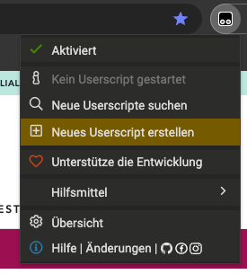
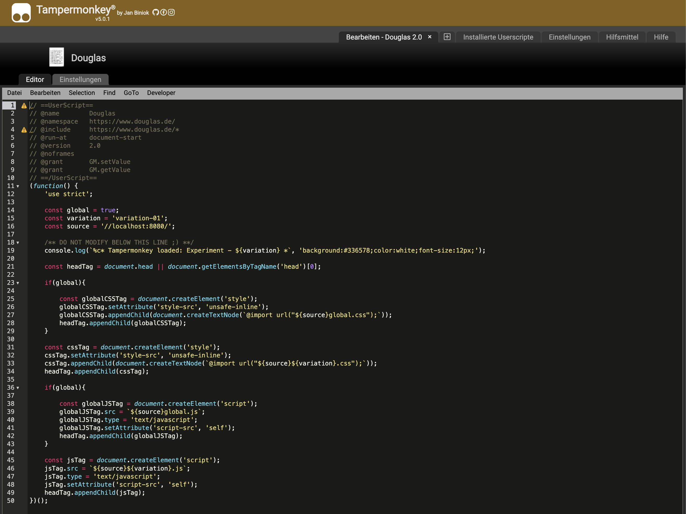
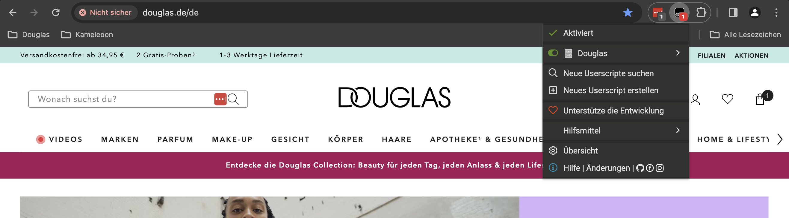
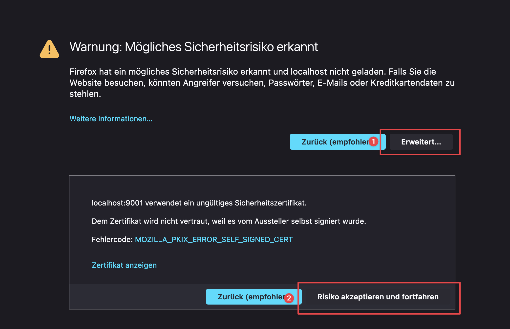

# DOUGLAS A/B Testing Boilerplate <!-- omit in toc -->

- [How to start](#how-to-start)
  - [Install](#install)
  - [How to use the Douglas A/B Testing Boilerplate](#how-to-use-the-douglas-ab-testing-boilerplate)
- [Development](#development)
  - [Tampermonkey](#tampermonkey)
  - [Webpack DevServer](#webpack-devserver)
  - [Problem with self-signed certificates](#problem-with-self-signed-certificates)
- [Simple build tools](#simple-build-tools)
  - [CodeKit (Mac)](#codekit-mac)
  - [Prepos (Windows)](#prepos-windows)
- [License](#license)

# How to start

**General questions, feedback or ideas?** [Get in contact with us :)](ma.vith@douglas.de)

## Install

### Packages <!-- omit in toc -->

Install with npm:
```sh
npm install 
```

Install with yarn:
```sh
yarn install 
```

### Webpack (optional) <!-- omit in toc -->

Install with npm:
```sh
npm install --global webpack
npm install --global webpack-cli
```

Install with yarn:
```sh
yarn global add webpack
yarn global add webpack-cli
```
## How to use the Douglas A/B Testing Boilerplate

### Development mode <!-- omit in toc -->

Run with npm:
```sh
npm run dev 
```

Run with yarn:
```sh
yarn dev 
```

Run specific variation: 
```sh
VARIATION=variation-02 npm run dev 
```

Now a [watch](https://webpack.js.org/configuration/watch/) task will run in the background. 

> Webpack can watch files and recompile whenever they change. This page explains how to enable this and a couple of tweaks you can make if watching does not work properly for you.

### Build mode <!-- omit in toc -->

Build with npm:
```sh
npm run build 
```
Build with yarn:
```sh
yarn build 
```
Development build (includes console.logs and Kameleoon uploads): 
```sh
npm run build-dev
```
Production build (Kameleoon uploads without console.logs):
```sh
npm run build-prod
```

As soon as you save a file in the `./src` folder, it is automatically generated in the `./dist` folder. You can use this JavaScript and CSS files for your local development with e.g. [Tampermonkey](https://www.tampermonkey.net/) as well as in your Testing-Tool. 

**Feel free to make adjustments to develop your own and individual boilerplate!**

# Development
This boilerplates includes the [Douglas A/B Testing Toolkit]() package. 

## Tampermonkey
We use the [Tampermonkey](https://www.tampermonkey.net/) browser add-on to simulate a testing tool. [Tampermonkey](https://www.tampermonkey.net/) is the most popular userscript manager, with over 10 million users. 

[Tampermonkey](https://www.tampermonkey.net/) makes it very easy to manage your userscripts and provides features like a clear overview over the running scripts, a built-in editor, ZIP-based import and export, automatic update checks and browser and cloud storage based synchronization.

### Install Tampermonkey <!-- omit in toc -->
Tampermonkey is available for [Chrome](https://chrome.google.com/webstore/detail/tampermonkey/dhdgffkkebhmkfjojejmpbldmpobfkfo), [Microsoft Edge](https://microsoftedge.microsoft.com/addons/detail/tampermonkey/iikmkjmpaadaobahmlepeloendndfphd), [Safari](https://apps.apple.com/us/app/tampermonkey/id1482490089?mt=12), [Opera](https://addons.opera.com/de/extensions/details/tampermonkey-beta/), and [Firefox](https://addons.mozilla.org/de/firefox/addon/tampermonkey/).

### Tampermonkey Douglas Script <!-- omit in toc -->
After you have installed [Tampermonkey](https://www.tampermonkey.net/) copy the following JavaScript: 

```js
// ==UserScript==
// @name        Douglas
// @namespace   https://www.douglas.de/
// @include     https://www.douglas.de/*
// @run-at      document-start
// @version     2.0
// @noframes
// @grant       GM.setValue
// @grant       GM.getValue
// ==/UserScript==
(function() {
	'use strict';

    const global = true;
    const variation = 'variation-01';
    const source = '//localhost:8080/';

    /** DO NOT MODIFY BELOW THIS LINE ;) **/
    console.log(`%c* Tampermonkey loaded: Experiment - ${variation} *`, 'background:#336578;color:white;font-size:14px;');

    const headTag = document.head || document.getElementsByTagName('head')[0];

    if(global){

        const globalCSSTag = document.createElement('style');
        globalCSSTag.setAttribute('style-src', 'unsafe-inline');
        globalCSSTag.appendChild(document.createTextNode(`@import url("${source}global.css");`));
        headTag.appendChild(globalCSSTag);
    }

    const cssTag = document.createElement('style');
    cssTag.setAttribute('style-src', 'unsafe-inline');
    cssTag.appendChild(document.createTextNode(`@import url("${source}${variation}.css");#webpack-dev-server-client-overlay{display:none}`));
    headTag.appendChild(cssTag);

     /** if(global){

        const globalJSTag = document.createElement('script');
        globalJSTag.src = `${source}global.js`;
        globalJSTag.type = 'text/javascript';
        globalJSTag.setAttribute('script-src', 'self');
        headTag.appendChild(globalJSTag);
    }

    const jsTag = document.createElement('script');
    jsTag.src = `${source}${variation}.js`;
    jsTag.type = 'text/javascript';
    jsTag.setAttribute('script-src', 'self');
    headTag.appendChild(jsTag); **/

    const jsTag = document.createElement('script');
    jsTag.src = `${source}bundle.js`;
    jsTag.type = 'text/javascript';
    jsTag.setAttribute('script-src', 'self');
    headTag.appendChild(jsTag);
})();
```

### Create a new Tampermonkey script <!-- omit in toc -->
Open the browser add-on and create a new Tampermonkey script for yourself:



And pase the script into a new Tampermonkey script: 



### Activate your script <!-- omit in toc -->

After a reload of the page you will see your new Tampermonkey script. After activation, the script will be executed automatically on (Douglas)[https://www.douglas.de/]. 



## Webpack DevServer

You can use any local or external server for developing A/B tests. However, we recommend using a local server to host your JavaScript and CSS files, such as Nginx or Apache. 

This boilerplate already contains a [DevServer](https://webpack.js.org/configuration/dev-server/), which is automatically started on your port `8080`. Just try [https://localhost:8080](https://localhost:8080).

Packages like [XAMPP](https://www.apachefriends.org/de/index.html) works too, you just need a SSL/HTTPS connection.

## Problem with self-signed certificates
Your connection is not private and your browser will block your connection. 

### Google Chrome <!-- omit in toc -->

Open [https://localhost:8080](https://localhost:8080/) and type `thisisunsafe`. Subsequently the connection will be admitted. 

> There's a secret passphrase built into the error page. Just make sure the page is selected (click anywhere on the screen), and just type `thisisunsafe`.

### Firefox <!-- omit in toc -->


# Simple build tools
Feel free to use your own tools / software. Alternatively, we recommend one of the following tools for our workshop.

## CodeKit (Mac)
Dozens of web development tools in one fully-native Mac app. Get to work without grunting, gulping, or 47 trips to Stack Overflow.

**Just download the app for a 30 day trial version [here](https://codekitapp.com/).**

## Prepos (Windows)
Prepros compiles your files, transpiles your JavaScript, reloads your browsers and makes it really easy to develop & test your websites so you can focus on making them perfect.

**Just download the app for a 30 day trial version [here](https://prepros.io/).**

# License
Copyright (c) 2024 **PARFÜMERIE Douglas GmbH & CO. KG**.

Licensed under The [MIT License](./LICENSE.md) (MIT).

[**PARFÜMERIE Douglas GmbH & CO. KG**](https://www.douglas.de/)